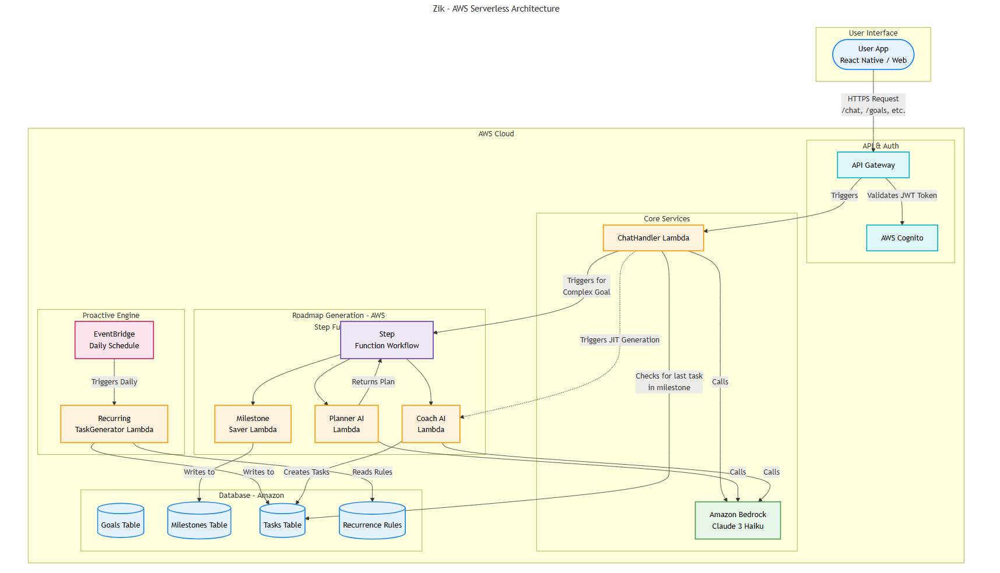

# 🎯 Zik Backend – AI-Powered Goal Management System

> **🌟 Looking for the Frontend?** Check out the [Zik Frontend Repository](https://github.com/izik-adio/zik-front) for the complete user interface and client-side application.

A modern, event-driven backend built entirely on AWS serverless technologies, powering the Zik AI life companion app. Zik transforms ambitious goals into actionable daily tasks through intelligent orchestration, leveraging the best of AWS Lambda, Step Functions, Amazon Bedrock, and more.

---

## 🚀 AWS-Powered Serverless Architecture

Zik is an AI-powered goal management system that transforms long-term ambitions into daily, achievable actions. Built on AWS, Zik leverages Lambda, Step Functions, and Bedrock to break down goals, generate just-in-time tasks, and provide a conversational interface—all with serverless scalability.

### **AWS Lambda**
AWS Lambda is the compute backbone of Zik, running all business logic as event-driven, stateless functions. Every API request, background process, and AI interaction is handled by Lambda, ensuring automatic scaling and cost efficiency. Lambda’s integration with other AWS services enables rapid development and seamless orchestration.

### **Amazon Bedrock**
Amazon Bedrock provides Zik’s conversational AI and intelligent task generation. By invoking Bedrock from Lambda, Zik delivers context-aware, natural language interactions and dynamic goal breakdowns. Bedrock’s managed foundation models ensure high-quality, secure, and scalable AI without infrastructure overhead.

### **AWS Step Functions**
AWS Step Functions orchestrate Zik’s complex, long-running workflows—such as multi-step goal planning and asynchronous AI operations. Step Functions coordinate Lambda invocations, manage state, and provide robust error handling, ensuring a non-blocking, reliable user experience even for intensive tasks.

### **Amazon DynamoDB**
Amazon DynamoDB is Zik’s primary data store, chosen for its serverless scalability and millisecond latency. All user profiles, chat histories, quests, and tasks are stored in DynamoDB tables, enabling real-time updates and seamless cross-device synchronization.

### **Amazon API Gateway**
Amazon API Gateway exposes Zik’s RESTful endpoints, providing secure, scalable, and monitored access to backend functionality. API Gateway integrates directly with Lambda for zero-administration compute, and enforces rate limiting and authentication at the edge.

### **Amazon EventBridge**
Amazon EventBridge enables event-driven automation within Zik. Key application events—such as quest completions or user onboarding—are published to EventBridge, triggering downstream Lambda functions and Step Functions workflows for decoupled, scalable processing.

### **Amazon Cognito**
Amazon Cognito manages user authentication and authorization, providing secure, standards-based identity management. Cognito’s integration with API Gateway and Lambda ensures that all endpoints are protected by JWT-based authentication, supporting both anonymous and registered users.

### **AWS Cloud Development Kit (CDK)**
The AWS CDK defines Zik’s entire infrastructure as code, enabling repeatable, version-controlled deployments. CDK synthesizes and deploys all resources—Lambda, API Gateway, DynamoDB, Cognito, Bedrock, and more—ensuring consistency across environments and rapid iteration.

---

### 🗺️ Architecture Diagram



*Figure: Zik’s event-driven, serverless architecture on AWS. User actions flow through API Gateway, triggering Lambda functions, Step Functions, and Bedrock-powered AI, with persistent state in DynamoDB and secure access via Cognito.*

---

## ✨ What Zik Does

- **Epic Quest System:** When a user creates a goal, an AWS Step Functions workflow is triggered asynchronously, orchestrating Lambda and Bedrock to generate a personalized roadmap.
- **Just-in-Time Task Generation:** Daily tasks are created on demand by Lambda functions, using context from DynamoDB and user preferences managed via Cognito.
- **Conversational AI:** All chat interactions are processed by Lambda, invoking Bedrock for natural language understanding and response, with chat history persisted in DynamoDB.
- **Comprehensive User Management:** Cognito secures all endpoints, while Lambda and DynamoDB manage user profiles and onboarding flows.
- **Smart Data Management:** DynamoDB stores all user data, with EventBridge and Lambda automating cleanup and real-time updates.

---

## 🏗️ Core AWS Components

- **Lambda Handlers:** Stateless compute for all business logic and API endpoints.
- **Step Functions:** Orchestration of multi-step, asynchronous workflows (e.g., goal planning, AI task generation).
- **Bedrock:** Foundation model-powered AI for chat and intelligent task breakdown.
- **DynamoDB:** NoSQL storage for user data, chat history, and quests.
- **API Gateway:** RESTful API with integrated authentication and rate limiting.
- **EventBridge:** Event-driven automation for decoupled, scalable processing.
- **Cognito:** Secure, standards-based user authentication and authorization.
- **CDK:** Infrastructure as code for rapid, repeatable deployments.

---

## 🧩 How It Works

1. **User Authentication:** All API requests are authenticated via Amazon Cognito, ensuring secure access.
2. **Goal Creation:** When a user sets a new goal, API Gateway triggers a Lambda function, which starts a Step Functions workflow. This workflow coordinates multiple Lambda steps and invokes Bedrock to generate a detailed plan.
3. **Task Generation:** Each day, Lambda functions generate context-aware tasks, using data from DynamoDB and user preferences from Cognito.
4. **Conversational AI:** User messages are routed through API Gateway to Lambda, which calls Bedrock for intelligent, context-aware responses. All chat history is stored in DynamoDB.
5. **Event-Driven Automation:** Key events (e.g., quest completion) are published to EventBridge, triggering additional Lambda functions for notifications, analytics, or cleanup.

---

## 🏆 Why AWS? (Technical Highlights)

- **Scalability:** All compute is serverless (Lambda, Step Functions), scaling automatically with user demand.
- **Resilience:** Step Functions provide robust error handling and state management for long-running workflows.
- **Security:** Cognito and API Gateway enforce strong authentication and authorization.
- **Speed:** DynamoDB delivers single-digit millisecond latency for all data operations.
- **AI at Scale:** Bedrock enables secure, scalable, and cost-effective AI without infrastructure management.
- **Observability:** CloudWatch and X-Ray provide end-to-end monitoring and tracing for all components.
- **Rapid Iteration:** CDK enables infrastructure as code, supporting fast, repeatable deployments.

---

## 🚀 Quick Start

### Prerequisites

- **Node.js** (v18+)
- **AWS CLI** configured with appropriate permissions
- **AWS CDK** installed globally (`npm install -g aws-cdk`)

### Installation

```bash
git clone https://github.com/yourusername/zik-backend.git
cd zik-backend
npm install
cp .env.example .env
# Edit .env with your AWS configuration or run the setup script:
scripts\setup-env.bat   # Windows
# or
chmod +x scripts/setup-env.sh
./scripts/setup-env.sh  # Linux/Mac
npm run build
cdk bootstrap
cdk deploy
```

---

## 🧪 Testing

All tests are run via Lambda-powered handlers, with data mocked in DynamoDB and workflows simulated using Step Functions local.

```bash
npm test
npm run test:coverage
npm run test:unit
npm run test:integration
```

---

## 🛠️ Challenges & AWS Solutions

- **Long-Running AI Workflows:** Zik leverages AWS Step Functions to orchestrate multi-step, asynchronous AI planning, ensuring a responsive user experience even for complex tasks.
- **Scalable, Real-Time Data:** DynamoDB and EventBridge enable real-time updates and event-driven automation, supporting thousands of concurrent users without bottlenecks.
- **Secure, Seamless Authentication:** Cognito and API Gateway provide robust, standards-based security with minimal operational overhead.
- **AI Integration:** By invoking Bedrock from Lambda, Zik delivers scalable, secure, and cost-effective AI, with no infrastructure to manage.

---

## 🤝 Contributing

We welcome contributions! Please see our Contributing Guidelines for details.

---

## 📄 License

This project is licensed under the MIT License – see the LICENSE file for details.

---

<div align="center">
  <p>Built with ❤️ and AWS for ambitious goal achievers</p>
  <p>
    <a href="#aws-powered-serverless-architecture">AWS Architecture</a> •
    <a href="#-what-zik-does">Features</a> •
    <a href="#-quick-start">Quick Start</a> •
    <a href="#-contributing">Contributing</a>
  </p>
</div>
