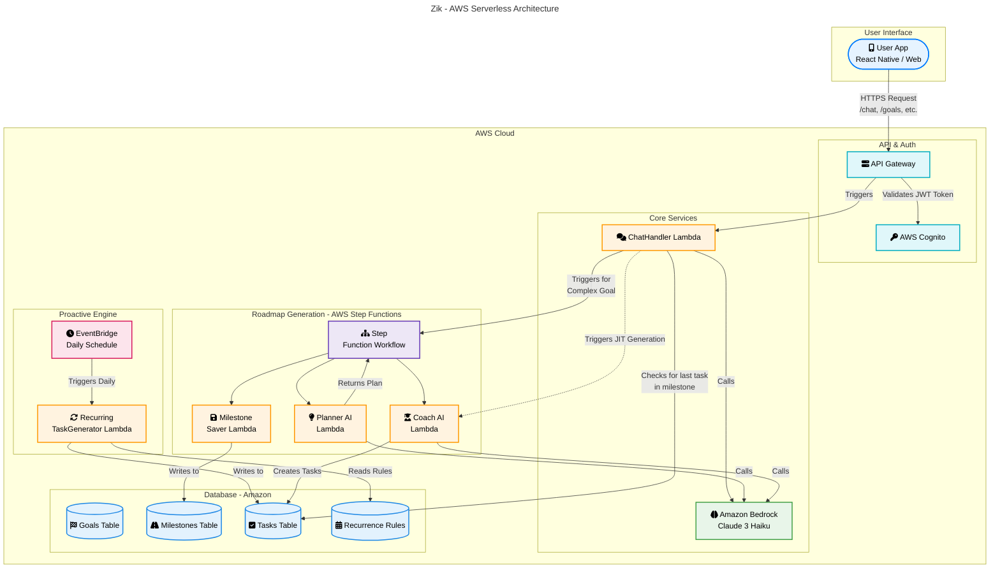

```mermaid
---
title: Zik - AWS Serverless Architecture
---
graph TD
    %% Define Styles for visual appeal
    classDef user fill:#e6f3ff,stroke:#007bff,stroke-width:2px,color:#000;
    classDef api fill:#e0f7fa,stroke:#00acc1,stroke-width:2px,color:#000;
    classDef lambda fill:#fff3e0,stroke:#ff9800,stroke-width:2px,color:#000;
    classDef stepfunc fill:#ede7f6,stroke:#673ab7,stroke-width:2px,color:#000;
    classDef event fill:#fce4ec,stroke:#d81b60,stroke-width:2px,color:#000;
    classDef db fill:#e3f2fd,stroke:#1e88e5,stroke-width:2px,color:#000;
    classDef ai fill:#e8f5e9,stroke:#43a047,stroke-width:2px,color:#000;

    %% Main Groups
    subgraph User Interface
        USER([<i class='fa fa-mobile-alt'></i> User App<br>React Native / Web])
    end

    subgraph AWS Cloud
        subgraph "API & Auth"
            APIGW[<i class='fa fa-server'></i> API Gateway]
            COGNITO[<i class='fa fa-key'></i> AWS Cognito]
        end

        subgraph "Core Services"
            CHAT_LAMBDA[<i class='fa fa-comments'></i> ChatHandler Lambda]
            BEDROCK[<i class='fa fa-brain'></i> Amazon Bedrock<br>Claude 3 Haiku]
        end

        subgraph "Proactive Engine"
            EVENTBRIDGE[<i class='fa fa-clock'></i> EventBridge<br>Daily Schedule]
            RECURRING_LAMBDA[<i class='fa fa-sync-alt'></i> Recurring<br>TaskGenerator Lambda]
        end

        subgraph "Roadmap Generation - AWS Step Functions"
            STEP_FUNCTIONS[<i class='fa fa-sitemap'></i> Step<br>Function Workflow]
            PLANNER_LAMBDA[<i class='fa fa-lightbulb'></i> Planner AI<br>Lambda]
            SAVER_LAMBDA[<i class='fa fa-save'></i> Milestone<br>Saver Lambda]
            COACH_LAMBDA[<i class='fa fa-user-graduate'></i> Coach AI<br>Lambda]
        end

        subgraph "Database - Amazon"
            GOALS_DB[(<i class='fa fa-flag-checkered'></i> Goals Table)]
            MILESTONES_DB[(<i class='fa fa-road'></i> Milestones Table)]
            TASKS_DB[(<i class='fa fa-check-square'></i> Tasks Table)]
            RECURRENCE_DB[(<i class='fa fa-calendar-alt'></i> Recurrence Rules)]
        end
    end

    %% Define Connections (The Flow)

    %% User to API
    USER -- "HTTPS Request<br>/chat, /goals, etc." --> APIGW
    APIGW -- "Validates JWT Token" --> COGNITO
    APIGW -- "Triggers" --> CHAT_LAMBDA

    %% ChatHandler Logic
    CHAT_LAMBDA -- "Triggers for<br>Complex Goal" --> STEP_FUNCTIONS
    CHAT_LAMBDA -.-> |"Triggers JIT Generation"| COACH_LAMBDA
    CHAT_LAMBDA -- "Calls" --> BEDROCK
    CHAT_LAMBDA -- "Checks for last task<br>in milestone" --> TASKS_DB

    %% Proactive Engine Flow
    EVENTBRIDGE -- "Triggers Daily" --> RECURRING_LAMBDA
    RECURRING_LAMBDA -- "Reads Rules" --> RECURRENCE_DB
    RECURRING_LAMBDA -- "Writes to" --> TASKS_DB

    %% Step Function Orchestration
    STEP_FUNCTIONS --> SAVER_LAMBDA
    STEP_FUNCTIONS --> PLANNER_LAMBDA
    STEP_FUNCTIONS --> COACH_LAMBDA
    PLANNER_LAMBDA -- "Returns Plan" --> STEP_FUNCTIONS

    %% AI and Database Interactions
    PLANNER_LAMBDA -- "Calls" --> BEDROCK
    COACH_LAMBDA -- "Calls" --> BEDROCK
    SAVER_LAMBDA -- "Writes to" --> MILESTONES_DB
    COACH_LAMBDA -- "Creates Tasks" --> TASKS_DB

    %% Apply Styles to Nodes
    class USER user;
    class APIGW,COGNITO api;
    class CHAT_LAMBDA,RECURRING_LAMBDA,PLANNER_LAMBDA,SAVER_LAMBDA,COACH_LAMBDA lambda;
    class STEP_FUNCTIONS stepfunc;
    class EVENTBRIDGE event;
    class GOALS_DB,MILESTONES_DB,TASKS_DB,RECURRENCE_DB db;
    class BEDROCK ai;
```
